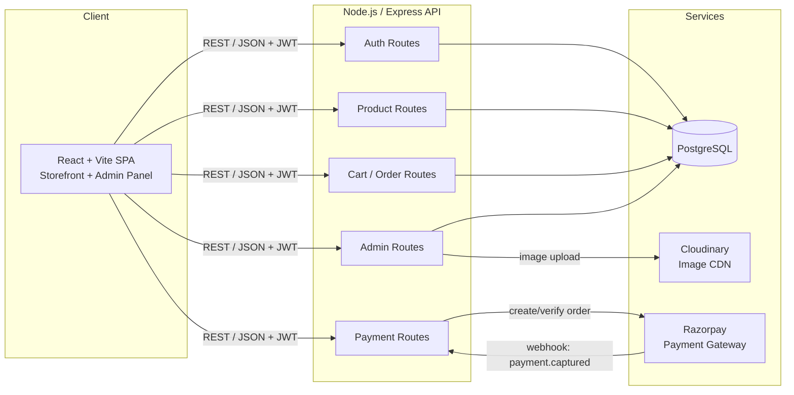
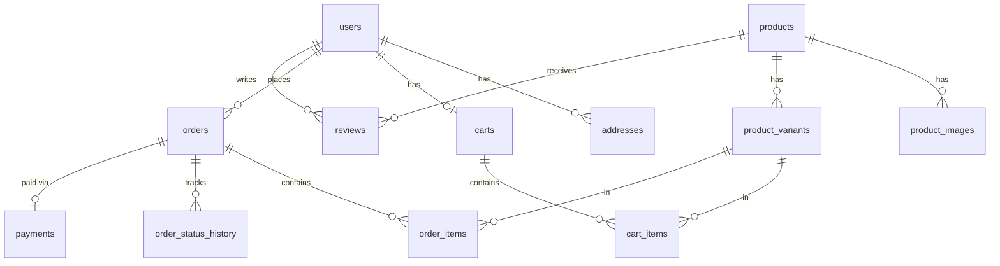

# RamKishan Siyaram — E-Commerce Website: Complete Plan & System Design

A full-stack e-commerce platform for the clothing store **"RamKishan Siyaram"** with a customer-facing storefront and an admin panel.

> **Visual design:** see [DESIGN.md](DESIGN.md) — sage/cream/charcoal palette, glassmorphism theme, Tailwind tokens, light + dark mode, responsive rules.

---

## 1. Tech Stack

| Layer | Technology | Why |
|---|---|---|
| Frontend | React 18 + Vite | Fast dev server, HMR, modern build tooling |
| Routing | React Router v6 | Client-side routing for SPA |
| State | Redux Toolkit (or Zustand) | Cart, auth, and product state shared across pages |
| Styling | Tailwind CSS | Rapid UI development; easy pill-navbar styling |
| HTTP | Axios (with interceptors) | Attach JWT automatically, central error handling |
| Backend | Node.js + Express | Simple, well-documented REST API server |
| Database | PostgreSQL + Prisma ORM | Relational integrity for orders/payments/stock; Prisma gives type-safe queries + migrations |
| Auth | JWT (access + refresh tokens), bcrypt | Stateless auth for users and admins |
| Payments | Razorpay (primary) / Stripe (alt) | Razorpay suits Indian stores (UPI, cards, netbanking); COD also supported |
| Image storage | Cloudinary (or S3) | Product image upload from admin panel |
| Validation | Zod / express-validator | Request validation on the API |
| Deployment | Frontend: Vercel/Netlify · Backend: Render/Railway · DB: Neon / Supabase / Railway Postgres | Free-tier friendly to start |

---

## 2. High-Level Architecture



**Request flow (buy a product):**
1. User adds product → cart (client state, synced to server for logged-in users).
2. Checkout → frontend calls `POST /api/orders` → backend validates stock & price from DB (never trust client prices).
3. Backend creates a Razorpay order → returns `order_id` → Razorpay checkout modal opens on frontend.
4. On payment success, frontend sends payment signature → backend verifies signature → marks order **PAID**, decrements stock.
5. Razorpay webhook acts as a fallback confirmation (handles the "user closed the tab after paying" case).

---

## 3. Database Schema (PostgreSQL — via Prisma)



### Tables

**`users`**
```sql
id (uuid PK), name, email (UNIQUE, indexed), password_hash,
role ('customer' | 'admin', default 'customer'), phone,
created_at, updated_at
```

**`addresses`**
```sql
id (PK), user_id (FK -> users), label, line1, line2, city, state,
pincode, is_default (bool), created_at
```

**`products`**
```sql
id (uuid PK), name, slug (UNIQUE, indexed), description,
category ('men'|'women'|'kids'|'accessories'), subcategory, brand,
price (numeric), mrp (numeric),
is_active (bool, default true), is_featured (bool, default false),
ratings_avg (numeric), ratings_count (int),
created_at, updated_at
-- Indexes: slug, (category, subcategory), is_featured,
-- GIN index on to_tsvector(name || ' ' || description) for full-text search
```

**`product_images`**
```sql
id (PK), product_id (FK -> products, ON DELETE CASCADE),
url, public_id, alt, sort_order (int)
```

**`product_variants`** — the unit that actually holds stock; cart & order items reference this
```sql
id (PK), product_id (FK -> products),
size ('S'|'M'|'L'|'XL'|'XXL'), color, sku (UNIQUE),
stock (int, CHECK stock >= 0),
UNIQUE (product_id, size, color)
```

**`carts`** / **`cart_items`**
```sql
carts:      id (PK), user_id (FK, UNIQUE), updated_at
cart_items: id (PK), cart_id (FK), variant_id (FK -> product_variants),
            qty (int, CHECK qty > 0), UNIQUE (cart_id, variant_id)
```

**`orders`**
```sql
id (uuid PK), order_number (UNIQUE, e.g. 'RKS-2026-00042'),
user_id (FK -> users),
-- shipping address snapshot (copied at checkout, not FK'd):
ship_name, ship_line1, ship_line2, ship_city, ship_state, ship_pincode, ship_phone,
subtotal, shipping_fee, discount, total (numeric),
status ('placed'|'confirmed'|'shipped'|'delivered'|'cancelled'),
created_at, updated_at
```

**`order_items`** — snapshots protect order history from later product edits
```sql
id (PK), order_id (FK -> orders), variant_id (FK -> product_variants),
name_snapshot, image_snapshot, size, color,
price_snapshot (numeric), qty (int)
```

**`payments`**
```sql
id (PK), order_id (FK -> orders, UNIQUE),
method ('razorpay'|'cod'),
razorpay_order_id, razorpay_payment_id, signature,
status ('pending'|'paid'|'failed'|'refunded'),
created_at, updated_at
```

**`order_status_history`**
```sql
id (PK), order_id (FK -> orders), status, note, created_at
```

**`reviews`** (phase 2)
```sql
id (PK), product_id (FK), user_id (FK), rating (int, CHECK 1..5),
comment, created_at, UNIQUE (product_id, user_id)
```

**`coupons`** (phase 2)
```sql
id (PK), code (UNIQUE), type ('percent'|'flat'), value,
min_order, expires_at, usage_limit, used_count
```

**Why this shape works well in Postgres:** checkout becomes a single ACID transaction (create order + order_items + payment row + decrement variant stock — all-or-nothing), foreign keys keep orders/variants consistent, `CHECK stock >= 0` makes overselling impossible at the DB level, and dashboard stats (revenue, top products) are simple SQL aggregates.

---

## 4. API Design (REST)

### Auth — `/api/auth`
| Method | Endpoint | Access | Purpose |
|---|---|---|---|
| POST | `/register` | Public | Create customer account |
| POST | `/login` | Public | Login → access + refresh token |
| POST | `/refresh` | Public | Rotate access token |
| POST | `/logout` | Auth | Invalidate refresh token |
| GET | `/me` | Auth | Current user profile |

### Products — `/api/products`
| Method | Endpoint | Access | Purpose |
|---|---|---|---|
| GET | `/` | Public | List with `?category=&subcategory=&size=&minPrice=&maxPrice=&sort=&search=&page=&limit=` |
| GET | `/featured` | Public | Featured products for home page |
| GET | `/:slug` | Public | Single product detail |
| POST | `/` | **Admin** | Create product (multipart w/ images) |
| PUT | `/:id` | **Admin** | Update product / stock |
| DELETE | `/:id` | **Admin** | Soft-delete (set `isActive: false`) |

### Cart — `/api/cart`
| Method | Endpoint | Access |
|---|---|---|
| GET / POST / PATCH / DELETE | `/`, `/items`, `/items/:itemId` | Auth — sync cart, add, update qty, remove |

### Orders & Payment — `/api/orders`, `/api/payment`
| Method | Endpoint | Access | Purpose |
|---|---|---|---|
| POST | `/api/orders` | Auth | Validate cart server-side, create order + Razorpay order |
| POST | `/api/payment/verify` | Auth | Verify Razorpay signature → mark paid, decrement stock |
| POST | `/api/payment/webhook` | Razorpay | Fallback payment confirmation (HMAC verified) |
| GET | `/api/orders/my` | Auth | Customer's order history |
| GET | `/api/orders/:id` | Auth/Admin | Order detail |

### Admin — `/api/admin` (all require `role: admin`)
| Method | Endpoint | Purpose |
|---|---|---|
| GET | `/stats` | Dashboard: revenue, order count, low-stock alerts, top products |
| GET | `/orders` | All orders with filters (status, date range) |
| PATCH | `/orders/:id/status` | Update order status (placed → shipped → delivered) |
| GET | `/customers` | Customer list |
| POST | `/upload` | Image upload → Cloudinary → returns URL |

**Middleware chain:** `rateLimiter → cors → helmet → json → authenticate (JWT) → authorize(role) → validate(schema) → controller → errorHandler`

---

## 5. Frontend — Pages & Components

### Route Map
```
PUBLIC (storefront)
├── /                      → HomePage
├── /products              → ProductListPage (filters, search, sort, pagination)
├── /products/:slug        → ProductDetailPage
├── /cart                  → CartPage
├── /login, /register      → AuthPages
CUSTOMER (protected — requires login)
├── /checkout              → CheckoutPage (address → payment)
├── /orders                → MyOrdersPage
├── /orders/:id            → OrderDetailPage (status timeline)
├── /profile               → ProfilePage (details, addresses)
ADMIN (protected — requires role=admin, separate layout)
├── /admin                 → DashboardPage (stats cards, charts)
├── /admin/products        → AdminProductsPage (table + search)
├── /admin/products/new    → ProductFormPage (add product + image upload)
├── /admin/products/:id    → ProductFormPage (edit)
├── /admin/orders          → AdminOrdersPage (status management)
├── /admin/customers       → AdminCustomersPage
404                        → NotFoundPage
```

### Component Tree
```
src/
├── components/
│   ├── layout/
│   │   ├── PillNavbar.jsx        ← top pill-shaped navbar (see below)
│   │   ├── Footer.jsx
│   │   ├── StorefrontLayout.jsx  (PillNavbar + Outlet + Footer)
│   │   └── AdminLayout.jsx       (Sidebar + Topbar + Outlet)
│   ├── home/
│   │   ├── HeroBanner.jsx        (store branding, CTA → /products)
│   │   ├── CategoryGrid.jsx      (Men / Women / Kids / Accessories tiles)
│   │   ├── FeaturedProducts.jsx  (carousel/grid of isFeatured items)
│   │   └── PromoStrip.jsx        (offers / free-shipping banner)
│   ├── products/
│   │   ├── ProductCard.jsx       (image, name, price, MRP strike, quick-add)
│   │   ├── ProductGrid.jsx
│   │   ├── FilterSidebar.jsx     (category, size, price range, color)
│   │   ├── SortDropdown.jsx      (price ↑↓, newest, popularity)
│   │   ├── SearchBar.jsx         (debounced, lives inside PillNavbar)
│   │   ├── Pagination.jsx
│   │   ├── ImageGallery.jsx      (detail page: thumbnails + zoom)
│   │   ├── SizeSelector.jsx      (pill buttons, disabled when out of stock)
│   │   └── QuantityStepper.jsx
│   ├── cart/
│   │   ├── CartItem.jsx, CartSummary.jsx, EmptyCart.jsx
│   ├── checkout/
│   │   ├── AddressForm.jsx, AddressCard.jsx
│   │   ├── PaymentMethodSelector.jsx  (Razorpay / COD)
│   │   └── OrderSuccess.jsx           (confirmation + order number)
│   ├── orders/
│   │   └── OrderStatusTimeline.jsx    (placed → shipped → delivered)
│   ├── admin/
│   │   ├── StatsCard.jsx, SalesChart.jsx, LowStockAlert.jsx
│   │   ├── ProductTable.jsx, ProductForm.jsx
│   │   ├── ImageUploader.jsx          (drag-drop, preview, multi-image)
│   │   ├── VariantEditor.jsx          (size/color/stock rows)
│   │   └── OrderTable.jsx, StatusUpdateModal.jsx
│   └── common/
│       ├── Button.jsx, Input.jsx, Modal.jsx, Spinner.jsx
│       ├── Toast.jsx, Badge.jsx, ProtectedRoute.jsx, AdminRoute.jsx
├── pages/            (one file per route above)
├── store/            (Redux slices: authSlice, cartSlice, productSlice, orderSlice)
├── services/         (api.js axios instance, productApi.js, orderApi.js, ...)
├── hooks/            (useAuth, useCart, useDebounce, useProducts)
└── utils/            (formatPrice, constants, validators)
```

### Pill Navbar Design
Fixed at top-center, floating capsule with `border-radius: 9999px`, subtle shadow, backdrop blur:

```
        ╭──────────────────────────────────────────────────────────────╮
        │  🏵 RamKishan Siyaram   Home  Products  Categories ▾   🔍  🛒² 👤 │
        ╰──────────────────────────────────────────────────────────────╯
```
- **Left:** store logo/name (links home)
- **Center:** nav links — active link gets a filled pill highlight that slides (Framer Motion `layoutId`)
- **Right:** search icon (expands inline), cart icon with item-count badge, profile/login dropdown
- **Mobile:** collapses to logo + hamburger; menu drops down as a rounded sheet
- Sticky with `backdrop-filter: blur`; slight shrink on scroll

---

## 6. Admin Panel Detail

| Page | Contents |
|---|---|
| **Dashboard** | Total revenue, orders today/this month, pending orders count, low-stock alerts (stock < 5), sales line chart (last 30 days), top-5 selling products |
| **Products** | Searchable/sortable table (image, name, category, price, total stock, active toggle), Add Product button |
| **Add/Edit Product** | Form: name, description (textarea), category/subcategory selects, price + MRP, featured toggle, **multi-image uploader** (Cloudinary), **variant editor** — add rows of size/color/stock |
| **Orders** | Table with filters (status, date), click → detail drawer, dropdown to advance status (triggers `statusHistory` entry) |
| **Customers** | List with order count and total spent per customer |

Admin access: seeded admin user (`role: "admin"` set via a seed script — no public admin signup). Admin routes guarded on **both** frontend (`AdminRoute`) and backend (`authorize("admin")` middleware) — frontend guard is UX only; the backend is the real gate.

---

## 7. Backend Folder Structure

```
server/
├── prisma/
│   ├── schema.prisma   (all models from section 3)
│   ├── migrations/     (generated by `prisma migrate dev`)
│   └── seed.js         (seed admin user + sample products)
├── src/
│   ├── config/         (prisma.js — PrismaClient singleton, cloudinary.js, razorpay.js, env.js)
│   ├── controllers/    (auth, product, cart, order, payment, admin)
│   ├── routes/         (one router per controller, mounted in app.js)
│   ├── middleware/     (auth.js, authorize.js, validate.js, errorHandler.js, upload.js)
│   ├── validators/     (zod schemas per resource)
│   ├── utils/          (generateOrderNumber.js, apiResponse.js)
│   ├── app.js          (express app + middleware + routes)
│   └── server.js       (entry: listen; Prisma connects lazily)
├── .env                (PORT, DATABASE_URL, JWT_SECRET, JWT_REFRESH_SECRET,
│                        RAZORPAY_KEY_ID/SECRET, CLOUDINARY_*, CLIENT_URL)
└── package.json
```

---

## 8. Security & Correctness Essentials

- **Never trust the client for money:** recompute order total from DB prices at checkout; verify Razorpay signature (`HMAC-SHA256`) server-side before marking paid.
- **Stock race conditions:** run checkout in a Postgres transaction with a conditional decrement (`UPDATE product_variants SET stock = stock - $qty WHERE id = $id AND stock >= $qty`) — if 0 rows are affected, roll back and return "out of stock". The `CHECK (stock >= 0)` constraint is the final safety net.
- Passwords: bcrypt (cost ≥ 10). JWTs: short-lived access token (15 min) + refresh token (httpOnly cookie).
- `helmet`, CORS locked to the frontend origin, rate limiting on auth & payment routes, input validation on every write endpoint.
- Image uploads: validate MIME type + size limit (e.g., 2 MB), upload to Cloudinary — never store on server disk.
- Soft-delete products so old orders keep rendering.

---

## 9. Build Phases (Milestones)

| Phase | Deliverable | Scope |
|---|---|---|
| **1. Foundation** | Repos scaffolded, running skeleton | Vite app + Express server + Postgres via Prisma (schema + first migration), env setup, layouts, pill navbar |
| **2. Products (read)** | Browsable store | Product model, seed data, list + detail pages, filters/search/pagination, home page |
| **3. Auth** | Login system | Register/login/JWT/refresh, protected routes, profile page |
| **4. Cart & Checkout** | Purchasable products | Cart (local + synced), address form, order creation, Razorpay integration + COD, order success + history |
| **5. Admin panel** | Store manageable | Admin layout, dashboard stats, product CRUD with image upload + variants, order status management |
| **6. Polish & deploy** | Live site | Toasts, loading skeletons, empty states, responsive pass, SEO meta, deploy (Vercel + Render + Neon/Supabase Postgres), Razorpay webhook in prod |
| **7. Phase-2 (later)** | Growth features | Reviews & ratings, coupons, wishlist, email notifications (order confirmation), invoice PDF |

---

## 10. Environment Variables Summary

| Variable | Used by |
|---|---|
| `VITE_API_URL`, `VITE_RAZORPAY_KEY_ID` | Frontend |
| `PORT`, `DATABASE_URL` (Postgres connection string), `CLIENT_URL` | Backend core |
| `JWT_SECRET`, `JWT_REFRESH_SECRET` | Auth |
| `RAZORPAY_KEY_ID`, `RAZORPAY_KEY_SECRET`, `RAZORPAY_WEBHOOK_SECRET` | Payments |
| `CLOUDINARY_CLOUD_NAME`, `CLOUDINARY_API_KEY`, `CLOUDINARY_API_SECRET` | Images |
